# Introduction to VLSI CAD
Time : 2021 spring (second half semester of sophomore)

## lecture
> more info in lec/*.pdf

|subject|teacher|
|:-:|:-:|
|[超大型積體電路電腦輔助設計概論](http://class-qry.acad.ncku.edu.tw/syllabus/online_display.php?syear=0109&sem=2&co_no=E232000&class_code=)|[邱瀝毅](https://www.ee.ncku.edu.tw/teacher/index2.php?teacher_id=152)|

<br>

## Report
> more info in doc/*.docx
- [lab02](#lab02)
- [lab03](#lab03)
- [lab04](#lab04)
- [lab05](#lab05)
- [lab06](#lab06)
- [lab08](#lab08)

<br>

## Environment
1. OS
- `CenterOS v6`

2. Software

|名稱|功能|
|:-:|:-:|
|NC Verilog|對HDL模擬真實電路並產生波型|
|nWave in Verdi|觀測波型`*.fsdb`|
|Superlint|檢查不符的格式，進行除錯|
|Design Vision|電路合成|
|HSPICE|類比電路模擬|
|Laker|佈局編輯器|
|Calibre|佈局驗證DRC、LVS、PEX|
|Mobaxterm|支援X11, sftp, ssh等傳輸協議，使遠端能連線工作站|

<br>

## How to run
- In lab6, provide `makefile`

|     Description                                   |     Command                           |
|---------------------------------------------------|---------------------------------------|
|     Run RTL Convolution simulation                |     `make rtl0`                       |
|     Run RTL Pooling simulation                    |     `make rtl1`                       |
|     Run RTL simulation                            |     `make rtl_full`                   |
|     Run post-synthesis simulation                 |     `make syn_full`                   |
|     Dump waveform (no array)                      |     `make {rtlX, syn_full} FSDB=1`    |
|     Dump waveform (with array)                    |     `make {rtlX, syn_full}   FSDB=2`  |
|     Open nWave without file pollution             |     `make nWave`                      |
|     Open Superlint without file   pollution       |     `make superlint`                  |
|     Open DesignVision without file   pollution    |     `make dv`                         |
|     Synthesize your RTL code                      |     `make synthesize`                 |
|     Check correctness of your file   structure    |     `make check`                      |
|     Compress your homework to tar   format        |     `make tar`                        |
|     Count the total lines of your   code          |     `wc –l ./src/*   ./include/*`     |

- compile
```
ncverilog top_module.v
```

- pre-simulate
```
ncverilog top_module_tb.v +define+FSDB access+r
```

- synthesis
    1. open Design Vision
    ```
    dv &
    ```
    2. change hierarchy
    ```
    current_design top
    ```
    3. read design constraints file
    ```
    source DC.sdc
    ```
    4. `Compile Design`-> `OK`
    5. generate report
    ```
    report_timing
    report_area
    report_power
    ```
    6. generate SDF file
    ```
    write_sdf
    version 2.1 context verilog load_delay net too_module_syn.sdf
    ```

- post-simulate
```
ncverilog top_module_tb.v +define+FSDB+syn access+r
```
- Superlint
    1. open
    ```
    jg -superlint
    ```
    2. `File` -> `TclScripts` -> `Source`
    3. Count the number of total lines
    ```
    wc –l filename
    ```

- check file hierarchy
```
sh check.sh
```
<br>

## lab2
### Encoder
 4-to-2 priority encoder in gate-level
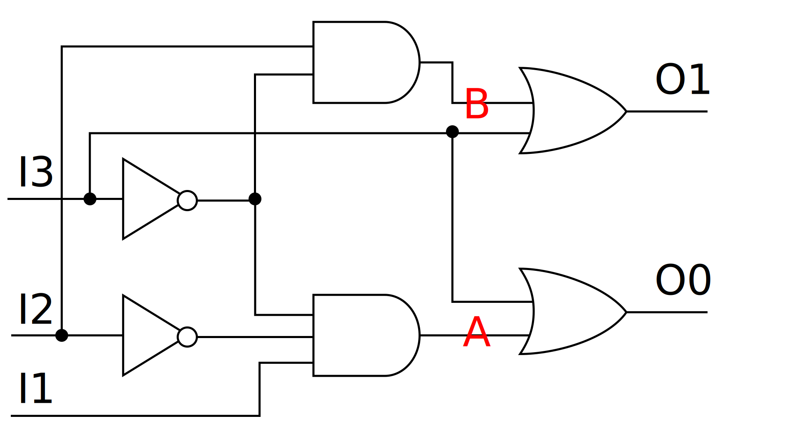

### Full Adder 
full adder in gate level
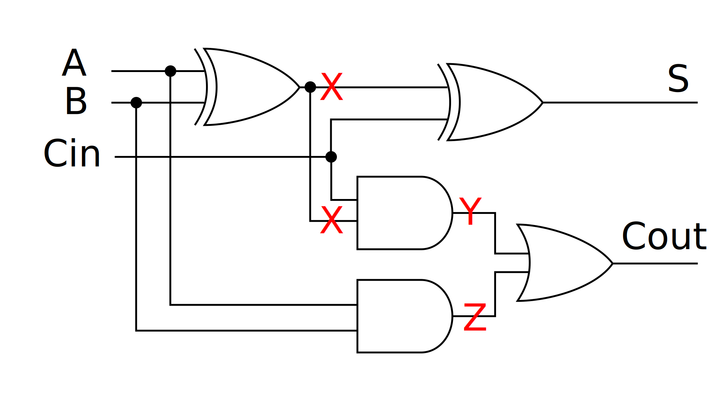

### Ripple Carry Adder
5-bit add/sub ripple carry adder in hierarchical coding
<br>
- call the FullAdder we design in Lab2 
```
include "File_Path/Filename" 
```

<br>

## lab3
### Multiplexer
8-to-1 multiplexer and testbench that needs to test all selected inputs and print results

### Arithmetic Logic Unit
1. operations

|alu_op|operation|description|
|:-:|:-:|:-:|
|01000|NOT|~src1|
|01001|NAND|~(src1&src2)|
|01010|MAX|max{sec1, src2}|
|01011|MIN|min{sec1, src2}|
|01100|ABS|\|src\||
|01101|SLTS|(src1<src2)?1:0|
|01110|SLL|src1<<src2|
|01111|ROTL|src1 rotate left by "src2 bits"|
|10000|ASSU|unsigned(src1+src2)|
|10001|SRLU|unsigned(src1>>src2)|

2. Port

|signal|type|bits|description|
|:-:|:-:|:-:|:-:|
|alu_enable|input|1|0->close;1->open|
|alu_op|input|5|opcode select which op to be execued|
|src1|input|32|ALU source 1|
|src2|input|32|ALU source 2|
|alu_out|output|32|ALU result|
|alu_overflow|output|1|0->no;1->yes|

### Grayscale Conversion
conversion formula : `y = 0.3125r + 0.5625g + 0.125b`

|input|output|
|:-:|:-:|
|24 bit RGB color values|8 bit grayscale values|

<br>

## lab4
### Register File
模擬 `64x32` register file寫入、存取、讀出的狀況。

### Vending Machine
分為三個階段
|階段|描述|
|:-:|:-:|
|Phase0|使用者投錢，機器並把錢先存在`money_temp`|
|Phase1|選擇飲料並把`money_temp`減去beverage的商品價格|
|Phase2|找錢`change = money_temp`，並把`finish`拉高，讓使用者知道交易已完成。此部分用conbinatioal寫，要與sequential電路分開寫|

### Convolution and activation function
沒修相關課程，大概有去看[神經網路科普影片](https://www.youtube.com/watch?v=aircAruvnKk)。但這題講白了這題就是**把兩個矩陣的個別元素相乘**，而對我來說難點在負數相乘要先做`sign extension`，而我的解題思路為
1. 個別輸入連到array上方便一次用`for loop`處理，有4種輸入的情況`w_w`和`if_w`皆為1，個別為1與都為0
2. 用`for loop`把array每一項個別處理
3. 把結果跟0位元cascade到17位，再做`sign extension`
4. 最後再乘得結果
5. `Rectified Linear Unit函數`映射(線性整流函數，活化函數主要目的是用來增加類神經網路模型的非線性)

<br>

## lab5
### Moore Machine

|CurrentState|NS (din = 0)|NS (din = 1)|qout|
|:---:|:---:|:---:|:---:|
|S0 = 00|S2|S1|1|
|S0 = 01|S1|S0|0|
|S0 = 10|S3|S2|0|
|S0 = 11|S3|S1|1|

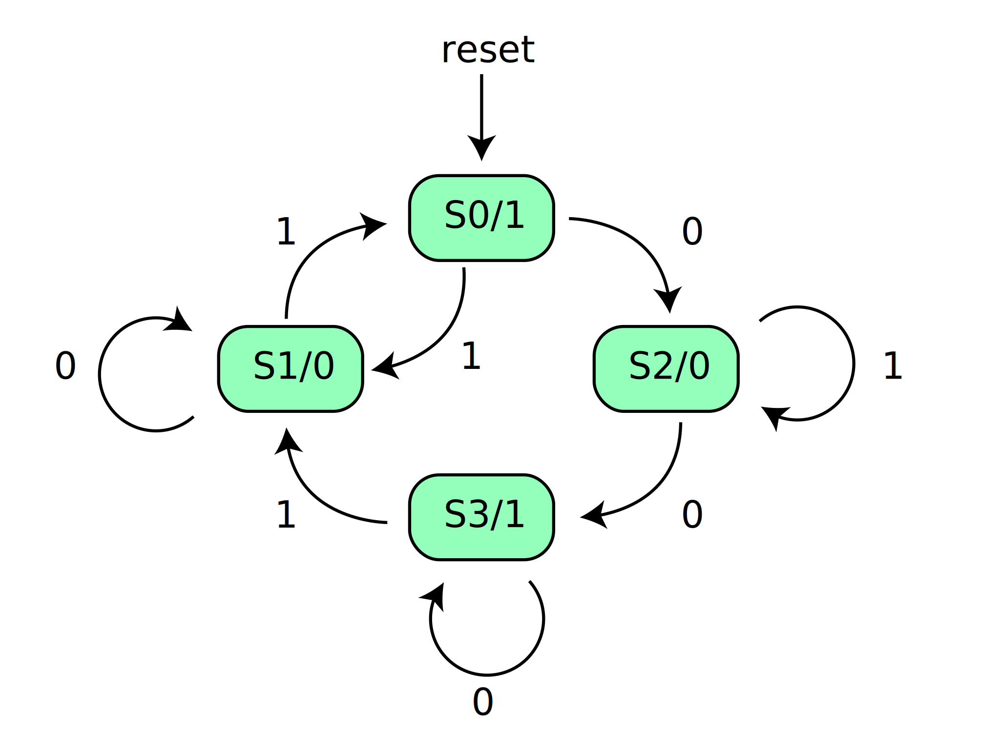

### Mealy Machine

|Current State|Next State, output||
|:-:|:-:|:-:|
|X|din = 0|din = 1|
|S0 = 00|S1,0|S2,0|
|S1 = 01|S1,1|S2,0|
|S2 = 11|S2,0|S0,1|

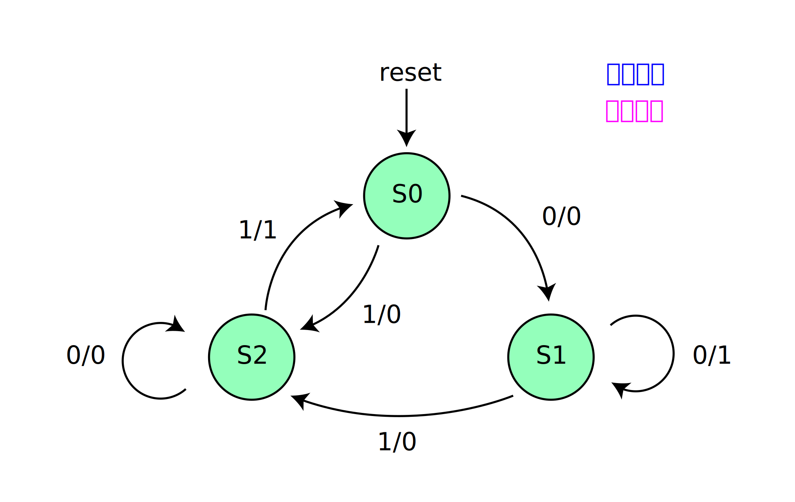

### Memory
- a `65536x24` bits random access memory
- a `16384x24` bits read only memory

### MAC using Shift Register

1. port

|signal|type|bits|description|
|:-:|:-:|:-:|:-:|
|clk|input|1|clock|
|rst|input|1|reset|
|clear|input|1|Set all register to 0|
|w_w|input|1|Write weight enable. When w_w is high, write w_in.|
|if_w|input|1|Write input feature map enable. When if_w is high, write if_in.|
|w_in|input|16|Input weight data|
|if_in|input|16|Input feature map data|
|out|output|34|Output data|

2. Shift register<br>
a cascade of flip flops.The output of each flip flop is connected to the input of the next flip flop.The output of each flip flop is connected to the input of the next flip flop.

### Grayscale Conversion System
1. spec<br>
The system will be able to **change RGB pictures to grayscale pictures**
2. block diagram of system
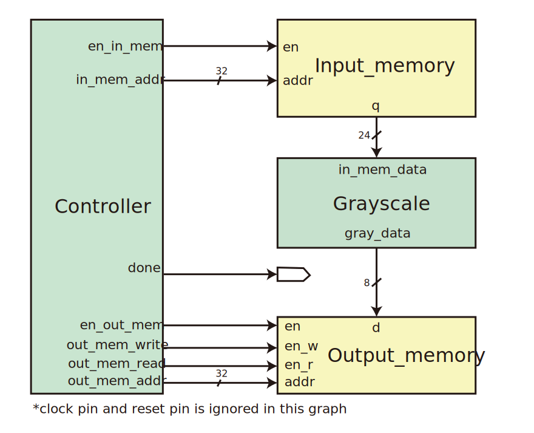

3. function
    1. reads pixel from the input memory.
    2. compute new value of pixels
    3. writes the new value pixel back to the output memory.
    4. repeats the process step (1)-(3) until the last pixel of output memory is updated.
    5. flags `done` when step (4) is completed


4. control signal

|signal|function|
|:-:|:-:|
|`en_in_mem`|enable input memory|
|`in_mem_addr`|input memory address|
|`en_out_mem`|enable output memory|
|`out_mem_read`|output memory read enable|
|`out_mem_write`|output memory write enable|
|`out_mem_addr`|output memory address|
|`done`|Stop the process|


5. state diagram
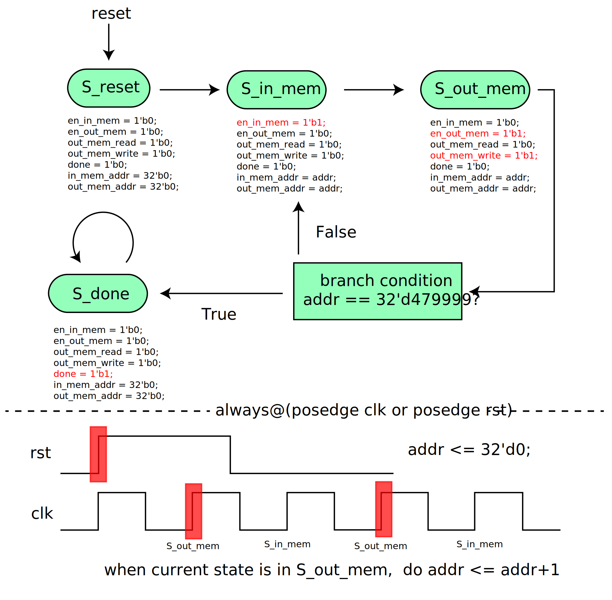

6. result

|Original Image|Results|
|:-:|:-:|
|||
|||
|||

7. Waveform
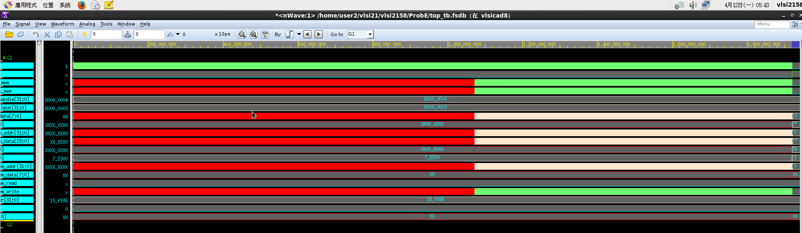
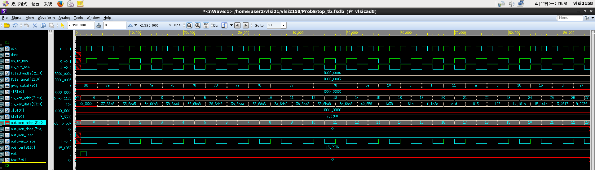
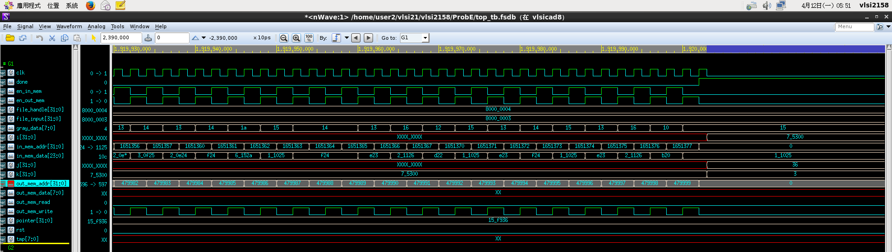
第一張圖為所有執行的波形圖，第二張為最一開始從`rst =1`，使`in_mem_addr`, `out_mem_addr`初始化從0開始加，`en_in_mem`與`en_out_mem`、`out_mem_write`隨`clk`交替拉高，進入讀入(`S_in_mem`)與讀出(`S_out_mem`)的狀態迴圈，一直到`out_addr`到`32'd479999`時，就是把整張480000像素的圖片跑完就進入`done = 1`卡在`S_done`的單一狀態裡面，符合上面設計的state diagram的大致流程。

8. SuperLint Coverage
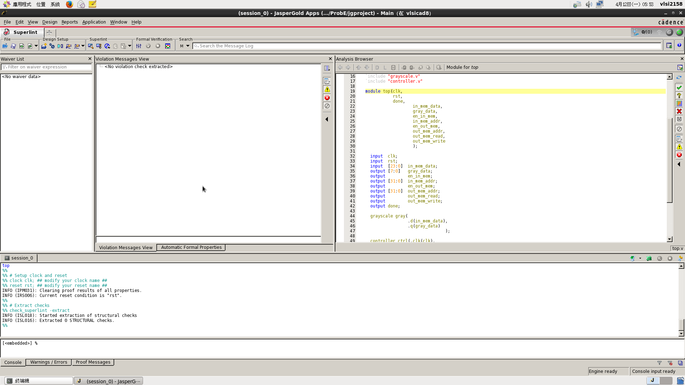
Coverage:`100%` (No any error or warning)

9. Synthesis Report
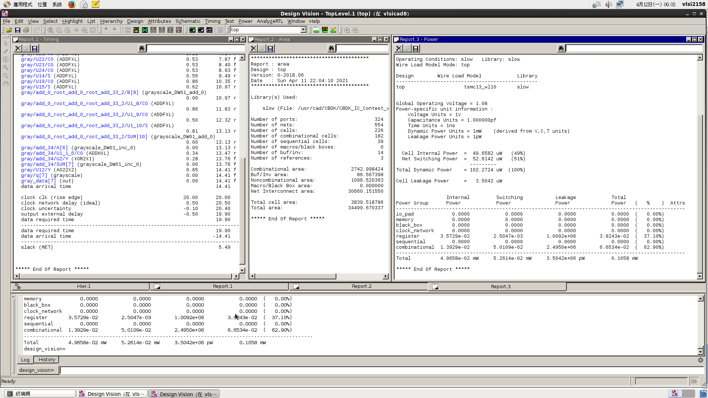

|Timing(slack)|Area(total cell area)|Power(total)|
|:-:|:-:|:-:|
|`5.49`|`3839.52`|`0.1058mW`|

10. Waveform after Synthesis
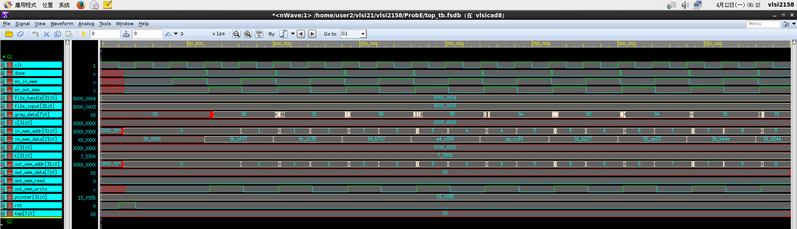

<br>

## lab6
### spec
integrate all components that you have learned so far to form a **simple convolution system**.

### block diagram of system
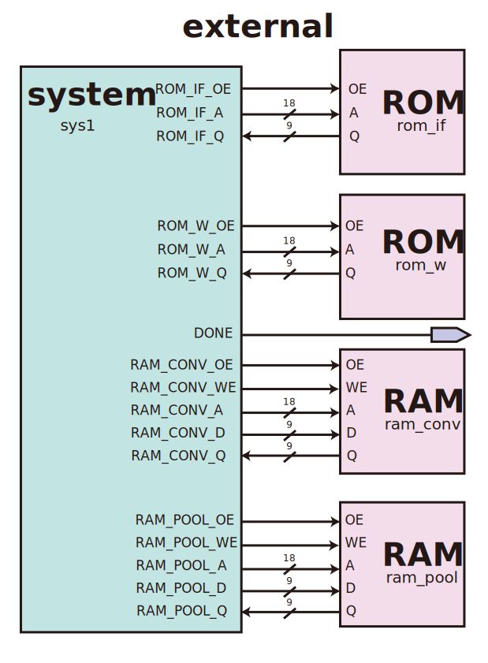
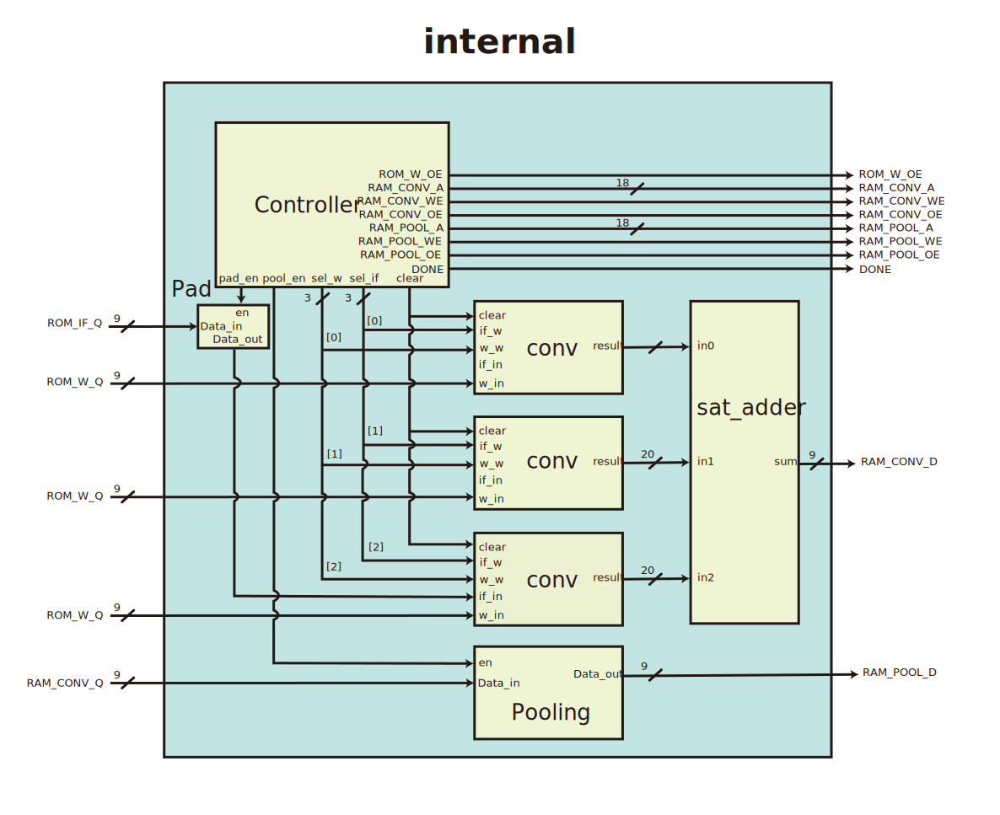

### function
1.	reads pixel from the `IFM ROM` to convolution block and consider the **padding problem**.
2.	computes new value of pixels.
3.	writes the convolution result back to the `CONV RAM`.
4.	repeats the process step (1)-(3) until the last pixel of `CONV RAM` is updated.
5.	reads pixel from the `CONV RAM` to **pooling block**.
6.	computes new value of pixels.
7.	writes the new value pixel back to the `POOL RAM`.
8.	repeats the process step (5)-(7) until the last pixel of `POOL RAM` is updated.
9.	flags `done` when step (8) is completed.

###  control signal
|signal|function|
|:-:|:-:|
|`ROM_IF_OE`|read data from `input feature map ROM`|
|`ROM_W_OE`|read data from `weight ROM`|
|`RAM_CONV_WE`|store the data to `CONV RAM`|
|`RAM_CONV_OE`|read data from `CONV RAM`|
|`RAM_POOL_WE`|store the data to `POOL RAM`|
|`RAM_POOL_OE`|read data from `POOL RAM`|
|`done`|stop the process|

###  design rules
- Do convolution with a 3\times3 weight map to the penguin.
- Consider the boundary condition to handle the padding problem.
- Do maximum pooling to the convolution result.
- Synthesize your `system.v` with following constraint:

|Clock period|no more than 20 ns|
|:-:|:-:|
|Synthesized Verilog file|`system_syn.v`|
|Timing constraint file|`system_syn.sdf`|

###  state diagram
- by myself (illustrator)
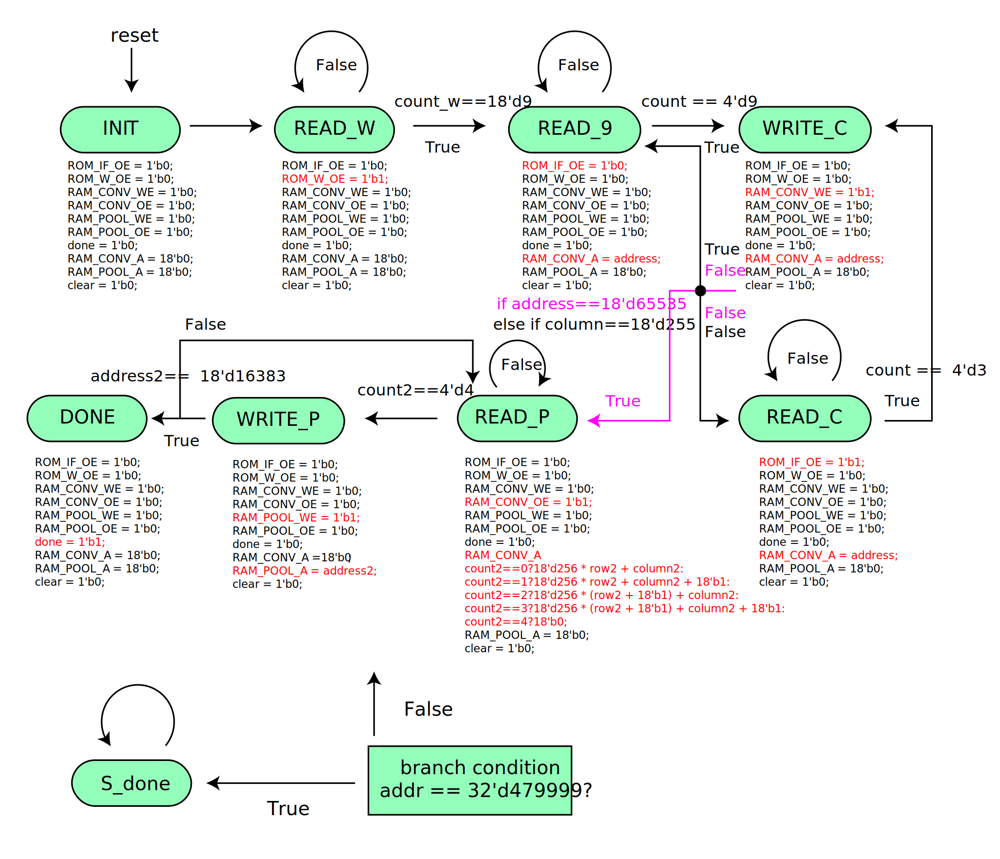
- Verdi
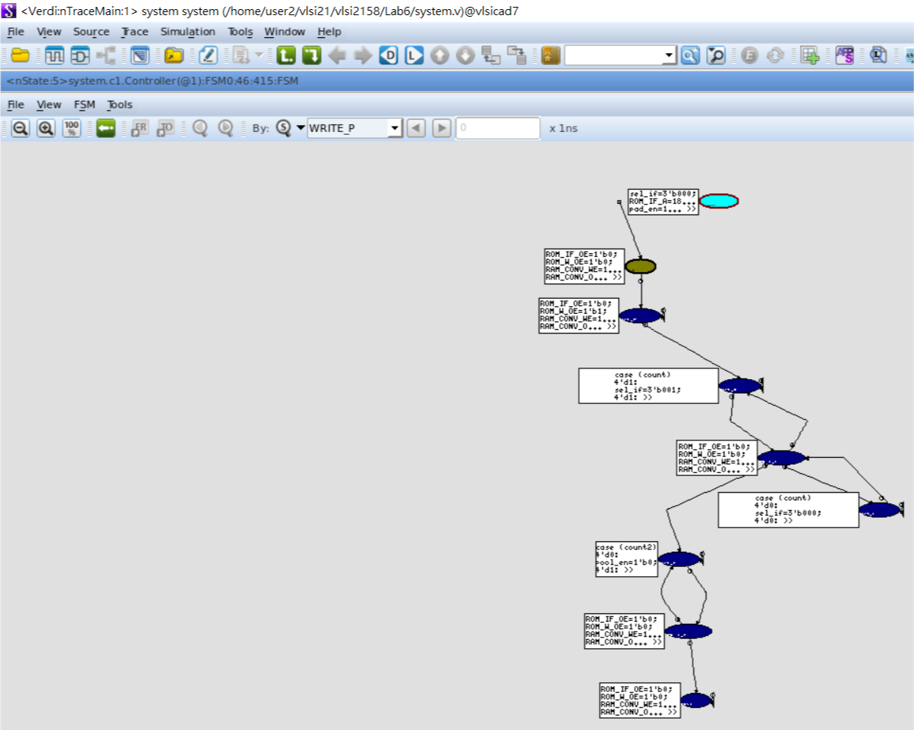
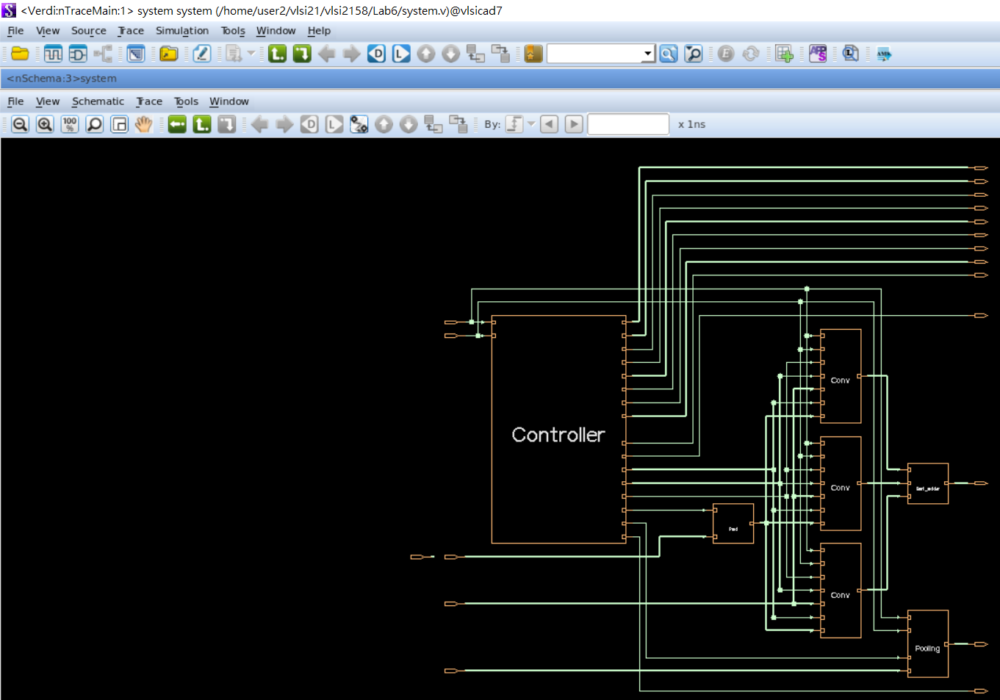


###  How to handle the boundary condition
- READ_9
    - 一般情況 <br>
    Cycle1、4、7 pad_en打開
    - 邊界情況 <br>
        1. `row == 18'b0` 額外Cycle2、3打開
        2. `row == 18'b255` 額外Cycle8、9打開
- READ_C
    - 一般情況 <br>
    `pad_en`皆關閉
    - 邊界情況 <br>
        1. `column == 18'b255` Cycle1、2、3 `pad_en`皆打開
        2. `row == 18'd0` Cycle1打開
        3. `row == 18'd255` Cycle3打開


###  simulation result
- terminal

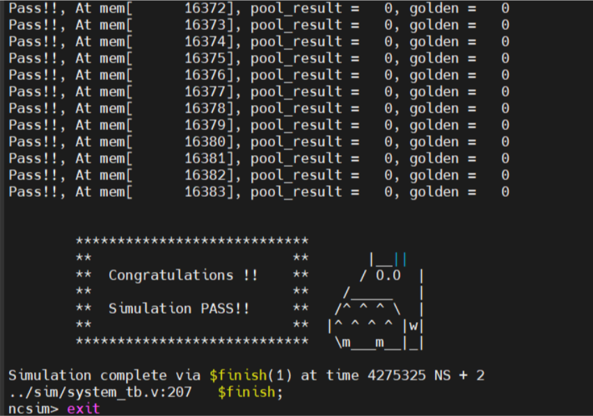

-  image

|Original|Result|
|:-:|:-:|
||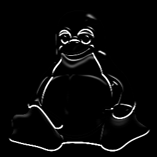|

###  Waveform
1. `cs[2:0]=READ_W`

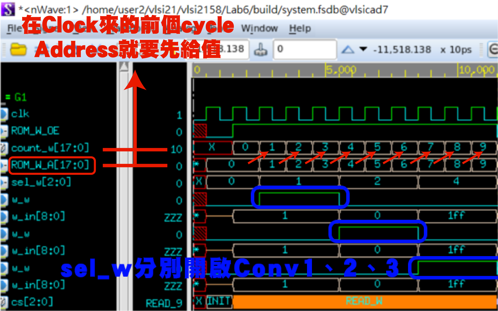

<br>

2. `cs[2:0]=READ_9`

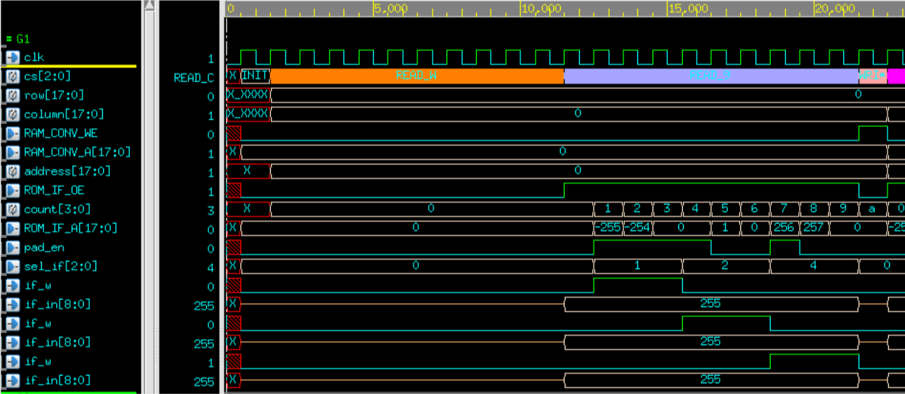
讀9筆資料，但因為**地址都要早一個Cycle給**，所以如上圖`count[3:0]`從0加到9，**共花了10個Cycle去完成`READ_9`這個state**。Cycle1、2、3、4、7 **`pad_en`拉高**，此時不用管地址，因為都是輸出0，而Cycle5、6、8、9，如上圖地址分別是**0、1、256、257**。`ROM_IF_OE`拉高讀ROM裡面原始企鵝的資料；而`RAM_CONV_WE`拉高把做完Convolution運算結果寫入`RAM_CONV`保存。

<br>

3. `cs[2:0]=READ_C`

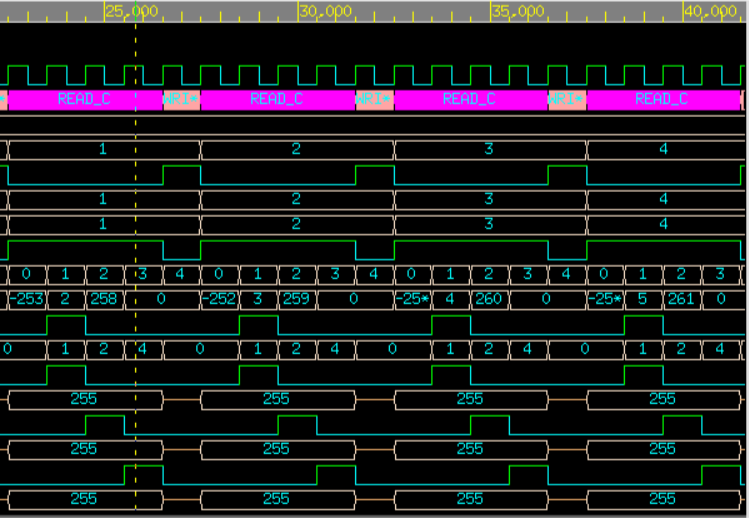<br>
如上述`cs[2:0]=READ_9`的行為，差別是指需要讀3筆資料而已，如上圖`count[3:0]`從0加到3，所以花了3+1=4個Cycle去完成。大部分的情況都是這樣，依序`READ_C`、`WRITE_C`交替。
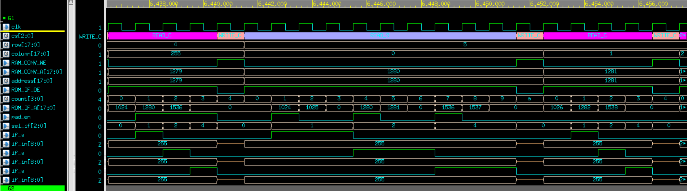<br>
在`column == 18'd255`時`padding`全部拉高，此時相對位置在Input Feature Map的右下角，接下來跳到狀態`READ_9`，row = row+1，而column歸0，從零開始數，如此不斷循環。
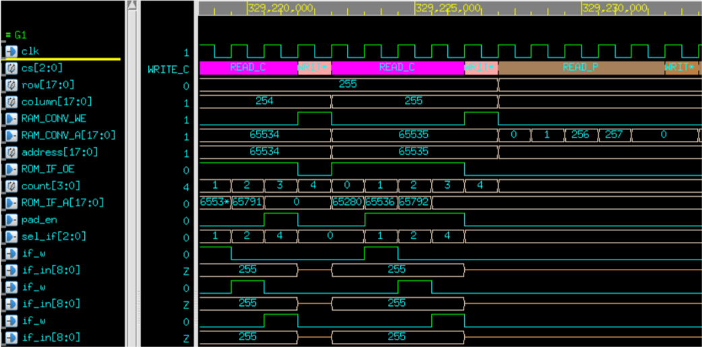<br>
直到`address == 18'd65535`時，第一階段Convolution完成，跳至下一個state-`READ_P`

<br>

4. `cs[2:0]=READ_P`

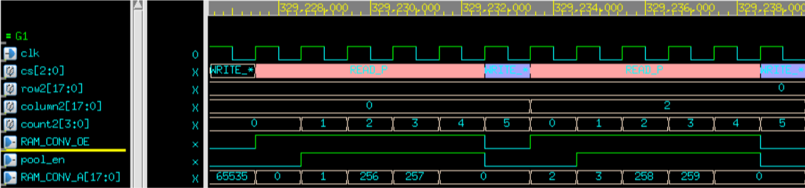<br>
一樣地址要早一個cycle給，`pool_en`拉高時，允許寫入 `Pooling.v`，如果`pool_en`拉低，我的設計就是維持`Pooling.v`的值。`RAM_CONV_OE`拉高為
把前一個做完Convoulution保存在`RAM_CONV`的data讀進來；而`RAM_POOL_WE`拉高則把結果寫入`RAM_POOL`保存。
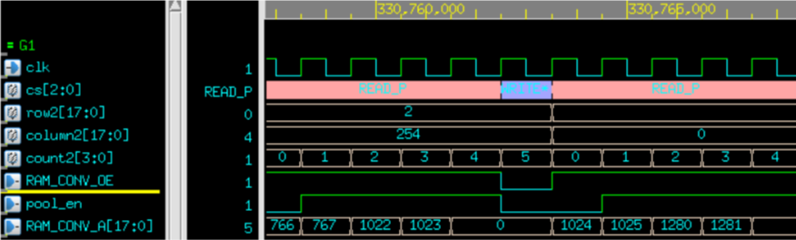<br>
在`column2 == 18'd254`時`row2 = row2+2`，而column歸0，從零開始數，如此不斷循環。
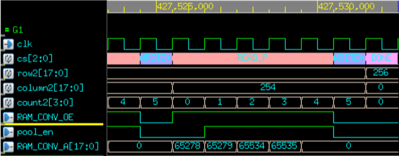<br>
當 `address2 == 18'd16383`時，第二階段`Pooling`完成，`DONE`拉高並卡在無窮迴圈之中，RTL code全部一、二階段執行流程結束。

###  SuperLint Coverage
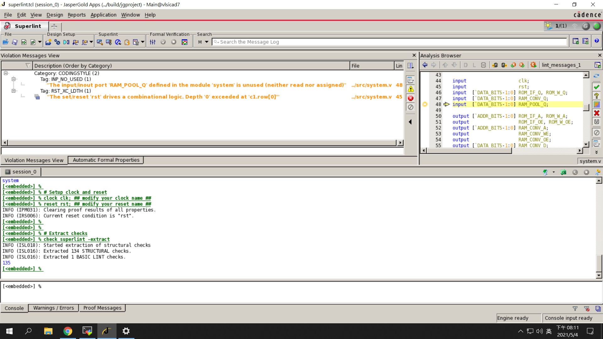
Coverage : `99%` (2error in `system.v`)
能解完的錯誤已解完，剩下兩個錯誤在`system.v`檔裡面。
|錯誤代碼|說明|
|:-:|:-:|
|`INP_NO_USE`|`RAM_POOL_Q`沒有接線，因為該線功能為將`RAM_POOL`傳data到system，這個功能在這次design沒有用到|
|`RXT_XC_LDTH`|猜測為`rst`訊號接線導致|

###  Synthesis Report
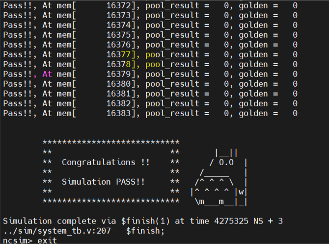

|Synthesizable clock period|Simulation time|Cell Area|Power|
|:-:|:-:|:-:|:-:|
|`10ns` (TA default)|`4275325ns`|`84011`|`1.3264mW`|

###  Waveform after Synthesis
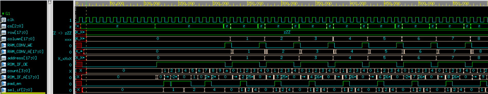

<br>

## lab8
設計一個inverter、nand、nor電路
1. 編譯成功
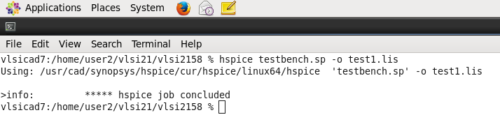

2. WaveView中的波型
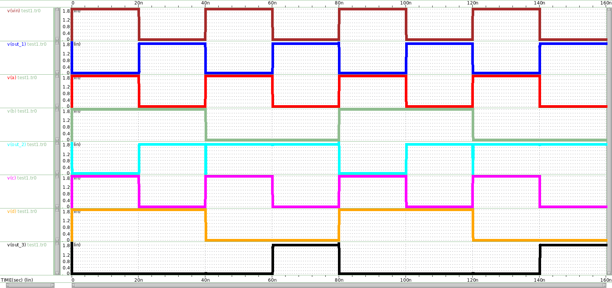

|電路|波型驗證|
|:-:|:-:|
|`inverter`|訊號做0變1、1變0|
|`NAND`|先做AND再做NOT|
|`NOR`|先做OR再做NOT|

## 心得
這堂課前半段是寫`Verilog`做數位電路模擬合成，用到的基本觀念有數位邏輯設計、計算機組織與`unix-like`環境的基本使用；後半段是`layout`，用到的基本觀念有電子學一二，但由於新冠疫情在本土延燒，後半的課只有上到lab9，在畫完inverter、nand、nor的`layout`後就幾乎結束了，有些可惜，不過大二下課業繁重。也給了我喘息的時間去讀電子學等其他科目。
<br>
比較重要或有趣的電路有
- lab5第五部分的`grayscale conversion system`
- lab6也就是final froject的`simple convolution system`

讓我學到要如何把演算法轉換成`RTL code`，尤其是lab6的**邊界條件**這部分是主要的困難點，再加上發現助教給的`testbench`似乎有把從`ROM`讀入的data調晚1個cycle，這些東西花了我很多的時間去完成，不過我也學到了很多東西，有了一點**由自己去design**的感覺。
<br><br>
其實這次作業很多部分是由助教代勞，像是linux環境下的`shell script`, `makefile`、由高階語言生成的`golden data`與`testbench`驗證以及那些system的`block`與彼此之間的`port`接線，我們學生完成的是**block內部電路的FSM實現**。
<br><br>
上完這堂課我覺得我應該精進自己的coding能力與對linux的掌握度，希望能達到真正了解整個設計流程的**designer**，別人開好文字描述的`spec`，自己從無到有、全部自己弄的獨立感。
